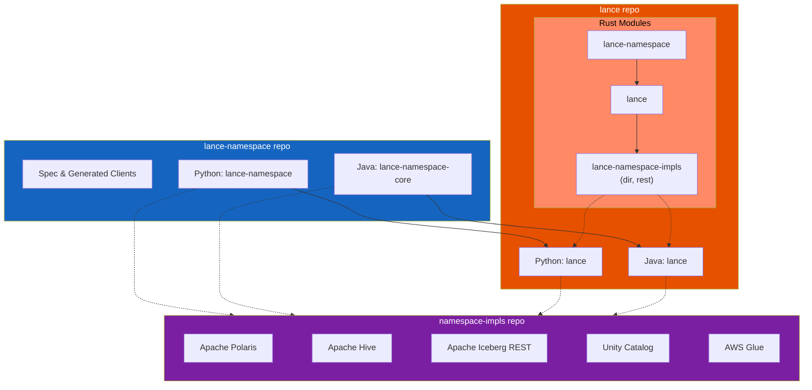

# Contributing to Lance Namespace

The Lance Namespace codebase is at [lance-format/lance-namespace](https://github.com/lance-format/lance-namespace).
This codebase contains:

- The Lance Namespace specification
- The core `LanceNamespace` interface and generic connect functionality for all languages except Rust
  (for Rust, these are located in the [lance-format/lance](https://github.com/lance-format/lance) repo)
- Generated clients and servers using OpenAPI generator

This project should only be used to make spec and interface changes to Lance Namespace,
or to add new clients and servers to be generated based on community demand.
In general, we welcome more generated components to be added as long as 
the contributor is willing to set up all the automations for generation and publication.

For contributing changes to directory and REST namespaces, please go to the [lance](https://github.com/lance-format/lance) repo.

For contributing changes to implementations other than the directory and REST namespace, 
or for adding new namespace implementations,
please go to the [lance-namespace-impls](https://github.com/lance-format/lance-namespace-impls) repo.

## Project Dependency

This project contains the core Lance Namespace specification and generated modules across all languages.
The dependency structure varies by language due to different build and distribution models.

### Rust

For Rust, the interface module `lance-namespace` and implementations (`lance-namespace-impls` for REST and directory namespaces)
are located in the core [lance-format/lance](https://github.com/lance-format/lance) repository.
This is because Rust uses source code builds, and separating modules across repositories makes dependency management complicated.

The dependency chain is: `lance-namespace` → `lance` → `lance-namespace-impls`

### Python and Java

For Python, Java, and other languages, the core `LanceNamespace` interface and generic connect functionality
are maintained in **this repository** (e.g., `lance-namespace` for Python, `lance-namespace-core` for Java).
The core [lance-format/lance](https://github.com/lance-format/lance) repository then imports these modules.

The reason for this import direction is that `lance-namespace-impls` (REST and directory namespace implementations)
are used in the Lance Python and Java bindings, and are exposed back through the corresponding language interfaces.

### Other Implementations

For namespace implementations other than directory and REST namespaces,
those are stored in the [lance-format/lance-namespace-impls](https://github.com/lance-format/lance-namespace-impls) repository,
with one implementation per language.

### Dependency Diagram



## Repository structure

This repository currently contains the following components:

| Component             | Language | Path                                   | Description                                                |
|-----------------------|----------|----------------------------------------|------------------------------------------------------------|
| Spec                  |          | docs/src                               | Lance Namespace Specification                              |
| Python Core           | Python   | python/lance_namespace                 | Core LanceNamespace interface and connect functionality    |
| Python UrlLib3 Client | Python   | python/lance_namespace_urllib3_client  | Generated Python urllib3 client for Lance REST Namespace   |
| Java Core             | Java     | java/lance-namespace-core              | Core LanceNamespace interface and connect functionality    |
| Java Apache Client    | Java     | java/lance-namespace-apache-client     | Generated Java Apache HTTP client for Lance REST Namespace |
| Java SpringBoot Server| Java     | java/lance-namespace-springboot-server | Generated Java SpringBoot server for Lance REST Namespace  |
| Rust Reqwest Client   | Rust     | rust/lance-namespace-reqwest-client    | Generated Rust reqwest client for Lance REST Namespace     |


## Install uv

We use [uv](https://docs.astral.sh/uv/getting-started/installation/) for development.
Make sure it is installed, and run:

```bash
make sync
```

## Lint

To ensure the OpenAPI definition is valid, you can use the lint command to check it.

```bash
make lint
```

## Build

There are 3 commands that is available at top level as well as inside each language folder:

- `make clean`: remove all codegen modules
- `make gen`: codegen and lint all modules (depends on `clean`)
- `make build`: build all modules (depends on `gen`)

You can also run `make <command>-<language>` to only run the command in the specific language, for example:

- `make gen-python`: codegen and lint all Python modules
- `make build-rust`: build all Rust modules

You can also run `make <command>-<language>-<module>` inside a language folder to run the command against a specific module, for example:

- `make gen-rust-reqwest-client`: codegen and lint the Rust reqwest client module
- `make build-java-springboot-server`: build the Java Spring Boot server module

## Documentation

### Setup

The documentation website is built using [mkdocs-material](https://pypi.org/project/mkdocs-material).
Start the server with:

```shell
make serve-docs
```

### Generated Model Documentation

The operation request and response model documentation is generated from the Java Apache Client.
When building or serving docs, the Java client must be generated first to produce the model Markdown files,
which are then copied to `docs/src/operations/models/`.

This happens automatically when running:

```shell
make build-docs  # or make serve-docs
```

These commands depend on `gen-java` to ensure the Java client docs are up-to-date before building the documentation.

### Understanding the Build Process

The contents in `lance-namespace/docs` are for the ease of contributors to edit and preview.
After code merge, the contents are added to the 
[main Lance documentation](https://github.com/lance-format/lance/tree/main/docs) 
during the Lance doc CI build time, and is presented in the Lance website under 
[Lance Namespace Spec](https://lance.org/lance/format/namespace).

## Release Process

This section describes the CI/CD workflows for automated version management, releases, and publishing.

### Version Scheme

- **Stable releases:** `X.Y.Z` (e.g., 1.2.3)
- **Preview releases:** `X.Y.Z-beta.N` (e.g., 1.2.3-beta.1)

### Creating a Release

1. **Create Release Draft**
   - Go to Actions → "Create Release"
   - Select parameters:
     - Release type (major/minor/patch)
     - Release channel (stable/preview)
     - Dry run (test without pushing)
   - Run workflow (creates a draft release)

2. **Review and Publish**
   - Go to the [Releases page](../../releases) to review the draft
   - Edit release notes if needed
   - Click "Publish release" to:
     - For stable releases: Trigger automatic publishing for Java, Python, Rust
     - For preview releases: Create a beta release (not published)
