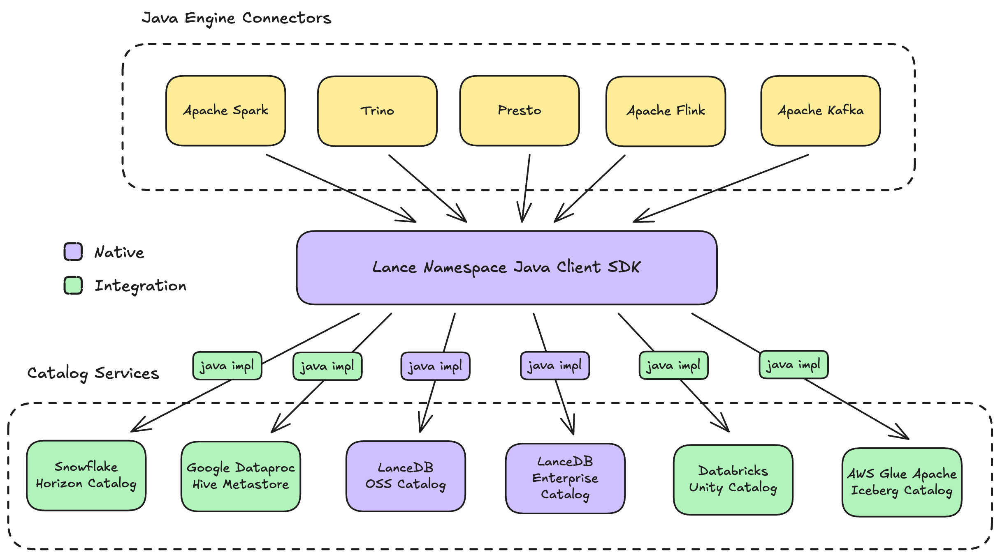

# Lance Namespace Spec

**Lance Namespace** is an open specification for describing access and operations against a collection of tables in a multimodal lakehouse.
The spec provides a unified model for table-related objects, their relationships within a hierarchy,
and the operations available on these objects — enabling integration with metadata services and compute engines alike.

## What the Lance Namespace Spec Contains

The Lance Namespace spec consists of three main parts:

1. **[Client Spec](client/index.md)**: A consistent abstraction that adapts to various catalog specs,
   allowing users to choose any catalog to store and use tables. This is the core reason why we call it
   "Namespace" rather than "Catalog" — namespace can mean catalog, schema, metastore, database, metalake, etc.,
   and the spec provides a unified interface across all of them.

2. **Native Catalog Specs**: Natively maintained catalog specs that are compliant with the Lance Namespace client spec:
    - **[Directory Namespace Spec](dir/catalog-spec.md)**: A storage-only catalog spec that requires no external metadata service dependencies —
      tables are organized directly on storage (local filesystem, S3, GCS, Azure, etc.)
    - **[REST Namespace Spec](rest/catalog-spec.md)**: A REST-based catalog spec ideal for data infrastructure teams that want to develop
      their own custom handling in their specific enterprise environments.

3. **Implementation Specs**: Defines how a given catalog spec integrates with the client spec.
   It details how an object in a Lance Namespace maps to an object in the specific catalog spec,
   and how each operation in Lance Namespace is fulfilled by the catalog spec.
   The implementation specs for Directory and REST namespaces are part of the native Lance Namespace spec.
   Implementation specs for other catalog specs
   (e.g. Apache Polaris, Unity Catalog, Apache Hive Metastore, Apache Iceberg REST Catalog)
   are considered **integrations** - anyone can provide additional implementation specs outside Lance Namespace,
   and they can be owned by external parties without needing to go through the Lance community voting process to be adopted.

## How the Spec Translates to Code

For each programming language, a Lance Namespace Client SDK provides a unified interface
that compute engines can integrate against.
For example, the Java SDK `org.lance:lance-namespace-core` enables engines like
Apache Spark, Apache Flink, Apache Kafka, Trino, and Presto to build their Lance connectors.

Each catalog spec has corresponding **implementations** in supported languages that fulfill the client SDK interface.
In this example, the Java implementations for Directory and REST namespaces are in `org.lance:lance-core`,
while third-party integrations are provided by dedicated libraries like `org.lance:lance-namespace-polaris` and `org.lance:lance-namespace-unity`.

All implementations must follow their respective implementation specs as the source of truth.
This separation of spec and implementation enables AI code agents to easily generate high-quality, language-specific implementations.