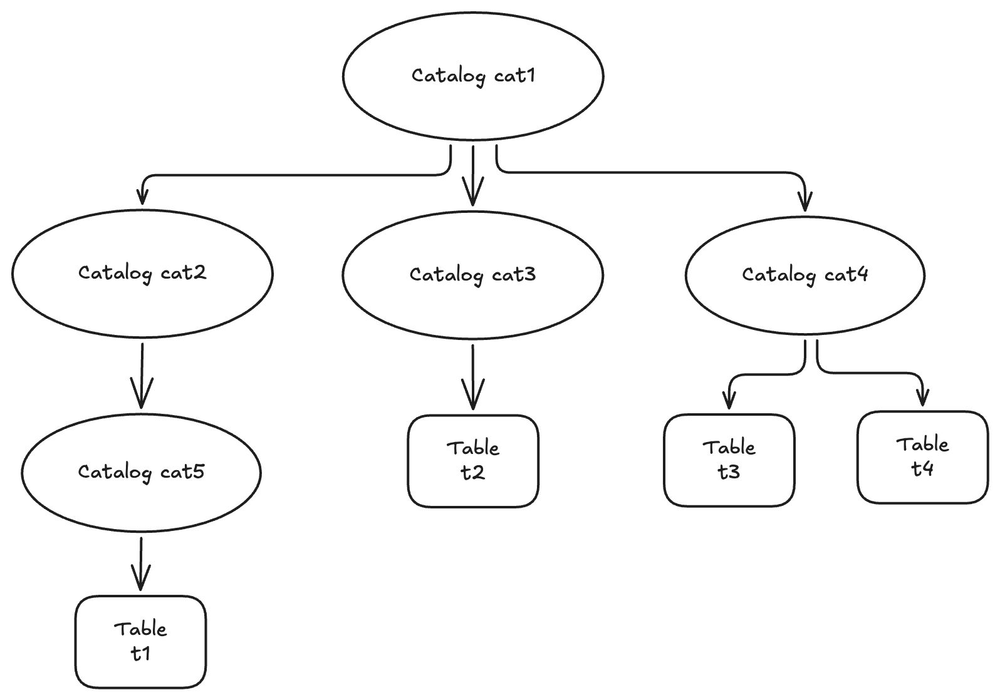

# Lance Catalog Specification

**Lance Catalog Specification** is an open specification on top of the storage-based Lance open table and data format 
to standardize access to a collection of Lance tables (a.k.a. Lance datasets).
It describes how a catalog service like Apache Hive MetaStore (HMS), Apache Gravitino, Unity Catalog, etc.
should store and use Lance tables, as well as how ML/AI tools and analytics compute engines
(will together be called _"tools"_ in this document) should integrate with Lance tables.

## Concepts

### Definition

A Lance catalog is a centralized repository for discovering, organizing, and managing Lance tables.
It can either contain a collection of tables, or a collection of Lance catalogs recursively.
It is designed to encapsulates concepts like namespace, metastore, database, schema, etc.
that could appear in other similar systems,
so that it can better integrate with any system with any type of object hierarchy.

Here is an example layout of a Lance catalog:



### Terminologies

We will use the example above to introduce some commonly used terminologies:

- **Root catalog** `cat1` contains 3 **child catalogs** `cat2`, `cat3` and `cat4`
- Catalog `cat2` contains a child catalog `cat5`. Conversely, `cat2` is the **parent catalog** of `cat5`.
- Catalog `cat3` contains a table `t2`
- Catalog `cat4` contains 2 tables `t3` and `t4`
- Catalog `cat5` contains a table `t1`

### Name and Identifier

The **name** of any object under the root catalog must be unique within the parent object. 

Use the same catalog example as above, we have:
 
- `cat2`, `cat3` and `cat4` are unique names under `cat1`
- `t3` and `t4` are unique names under `cat4`

The **identifier** of an object under the root catalog is a string that 
uniquely identifies the object among all objects in the root catalog.
it is the list of names of all objects starting under (not including) the root catalog.
The dot (`.`) symbol is typically used as the delimiter to join all the names to form a string identifier, 
but other symbols could also be used if dot is used in the object name.

Use the same catalog example as above, we have:

- the identifier of `t1` is `[cat2, cat5, t1]` in list form or `cat2.cat5.t1` in string form
- the identifier of `cat5` is `cat2.cat5` in string form
- the identifier of `t3` is `cat4$t3` in string form when using delimiter `$`

The root catalog itself technically does not have a fixed name or identifier.
It is typically assigned by users through some configuration when used in a tool.
For example, a Lance catalog can be called `cat1` in Ray, but `cat2` in Apache Spark,
but they are both configured to connect to the same server with URI `https://mylancecatalog.com`.

## Catalog Types

There are 2 types of Lance catalogs: directory catalog and REST catalog.

### Lance Directory Catalog

**Lance directory catalog** is a lightweight and simple Lance catalog that only contains a list of tables.
People can easily get started with creating and using Lance tables directly on top of any 
local or remote storage system with a Lance directory catalog.

The directory catalog maps to a directory on storage.
A Lance table corresponds to a subdirectory in the directory.
We call such a subdirectories **Table Directory**.
Consider the following example directory layout:

```
.
└── /my/dir1/
    ├── table1/
    │   ├── data/
    │   │   ├── 0aa36d91-8293-406b-958c-faf9e7547938.lance
    │   │   └── ed7af55d-b064-4442-bcb5-47b524e98d0e.lance
    │   ├── _versions/
    │   │   └── 9223372036854775707.manifest
    │   ├── _indices/
    │   │   └── 85814508-ed9a-41f2-b939-2050bb7a0ed5-fts/
    │   │       └── index.idx
    │   └── _deletions/
    │       └── 75c69434-cde5-4c80-9fe1-e79a6d952fbf.bin
    ├── table2
    └── table3
```

This describes a Lance directory catalog at `/my/dir1/` that contains tables `table1`, `table2`, `table3`
sitting at table directories `/my/dirs/table1`, `/my/dirs/table2`, `/my/dirs/table3` respectively.

#### Directory Path

There are 3 ways to specify a directory path:

1. **URI**: a URI that follows the [RFC 3986 specification](https://datatracker.ietf.org/doc/html/rfc3986), e.g. `s3://mu-bucket/prefix`.
2. **Absolute POSIX storage path**: an absolute file path in a POSIX standard storage, e.g. `/my/dir`.
3. **Relative POSIX storage path**: a relative file path in a POSIX standard storage, e.g. `my/dir2`, `./my/dir3`.
   The absolute path of the directory should be based on the current directory of the running process.

#### Table Existence

A table exists in a Lance directory catalog if a table directory of the specific name exists.
This is true even if the directory is empty or the contents in the directory does not follow the Lance table format spec.
For such cases, an operation that lists all tables in the directory should show the specific table,
and an operation that checks if a table exists should return true.
However, an operation that loads the Lance table metadata should fail with error 
indicating the content in the folder is not compliant with the Lance table format spec.

### Lance REST Catalog

In an enterprise environment, typically there is a requirement to store tables in a catalog service 
such as Apache Hive MetaStore, Apache Gravitino, Unity Catalog, etc. 
for more advanced governance features around access control, auditing, lineage tracking, etc.
**Lance REST catalog** is an OpenAPI protocol that enables reading, writing and managing Lance tables
by connecting those catalog services or building a custom catalog server in a standardized way.
The detailed OpenAPI specification content can be found in [rest-catalog.yaml](./rest-catalog.yaml).

#### Catalog Server and Adapter

Any REST HTTP server that implements this OpenAPI protocol is called a **Lance Catalog Server**.
If the main purpose of this server is to be a proxy on top of an existing catalog service,
converting back and forth between Lance REST API models and native API models of the catalog service,
then this Lance catalog server is called a **Lance Catalog Adapter**.

#### Relationship with Lance Table on Storage

This section defines the possible relationships between a Lance table definition in a REST catalog and
the corresponding Lance table sitting in some storage system.
A catalog can choose to support one or multiple types of relationships when integrating with the REST protocol.

##### Catalog Managed Table

A catalog managed Lance table is a table that is fully managed by a catalog.
The catalog must contain information about the latest version of the Lance table.
Any modifications to the table must happen through the catalog.
If a user directly modifies the underlying table in the storage bypassing catalog,
the catalog must not reflect the changes in the table to the catalog users.

This mode ensures the catalog service is aware of all activities in the table,
and can thus fully enforce any governance and management features for the table. 

##### Storage Managed Table

A storage managed Lance table is a table that is fully managed by the storage with a metadata definition in catalog.
The catalog only contains information about the table directory location.
It is expected that a tool finds the latest version of the Lance table based on the contents 
in the table directory according to the Lance format specification.
A modification to the table can happen either directly against the storage,
or happen as a request to the catalog, where the catalog is responsible for applying the corresponding
change to the underlying storage according to the ance format specification.

This mode is more flexible for real world ML/AI workflows 
but the catalog loses full visibility and control over the actions performed against the table,
so it will be harder to enforce any governance and management features for storage managed tables.

## Tool Integration Guidelines

The following are guidelines for tools to integrate with Lance catalogs.
Note that these are recommendations rather than hard requirements.
The goal of these guidelines is to offer a consistent user experience across different tools.

### Configurations

We recommend tools to offer the following configurations in some form or shape 
for users to configure connection to a Lance catalog:

| Config Key | Description                                                                                 | Required?                   | 
|------------|---------------------------------------------------------------------------------------------|-----------------------------|
| type       | The type of the catalog, either `dir` for Lance directory, or `rest` for Lance REST Catalog | Yes                         |
| path       | The path to the Lance directory catalog                                                     | Yes for `dir` catalog type  | 
| uri        | The HTTP URI for the Lance REST Catalog                                                     | Yes for `rest` catalog type |
